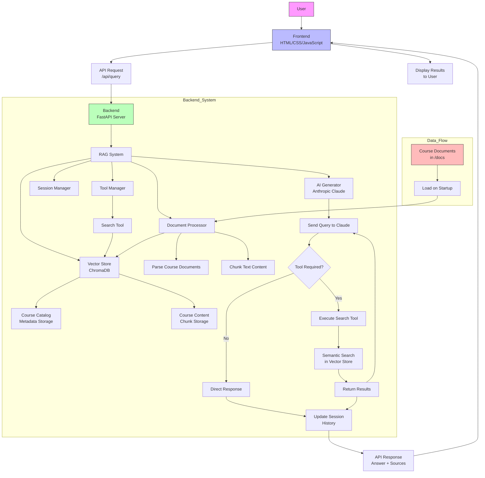

# RAG Chatbot System Architecture

```mermaid
flowchart TD
    A[User] --> B[Frontend<br/>HTML/CSS/JavaScript]
    B --> C[API Request<br/>/api/query]
    C --> D[Backend<br/>FastAPI Server]
    
    subgraph Backend_System
        D --> E[RAG System]
        
        E --> F[Document Processor]
        E --> G[Vector Store<br/>ChromaDB]
        E --> H[AI Generator<br/>Anthropic Claude]
        E --> I[Session Manager]
        E --> J[Tool Manager]
        
        J --> K[Search Tool]
        K --> G
        
        F --> L[Parse Course Documents]
        F --> M[Chunk Text Content]
        
        G --> N[Course Catalog<br/>Metadata Storage]
        G --> O[Course Content<br/>Chunk Storage]
        
        H --> P[Send Query to Claude]
        P --> Q{Tool Required?}
        Q -->|Yes| R[Execute Search Tool]
        R --> S[Semantic Search<br/>in Vector Store]
        S --> T[Return Results]
        T --> P
        Q -->|No| U[Direct Response]
        
        U --> V[Update Session<br/>History]
        T --> V
    end
    
    V --> W[API Response<br/>Answer + Sources]
    W --> B
    B --> X[Display Results<br/>to User]
    
    subgraph Data_Flow
        Y[Course Documents<br/>in /docs] --> Z[Load on Startup]
        Z --> F
        F --> G
    end
    
    style A fill:#f9f,stroke:#333
    style B fill:#bbf,stroke:#333
    style D fill:#bfb,stroke:#333
    style Y fill:#fbb,stroke:#333
```