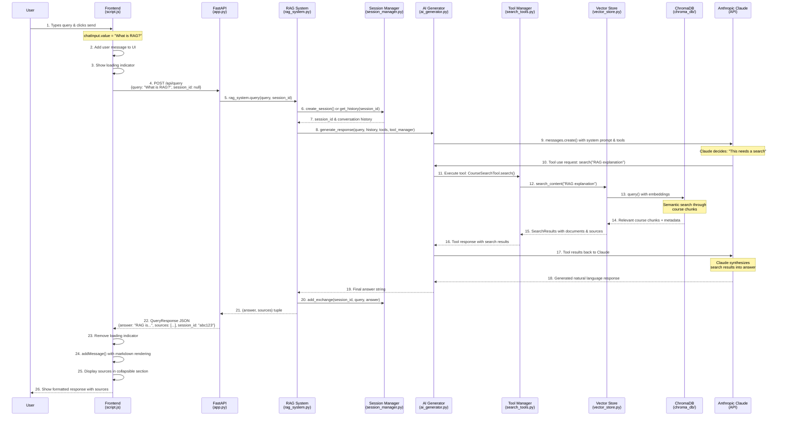
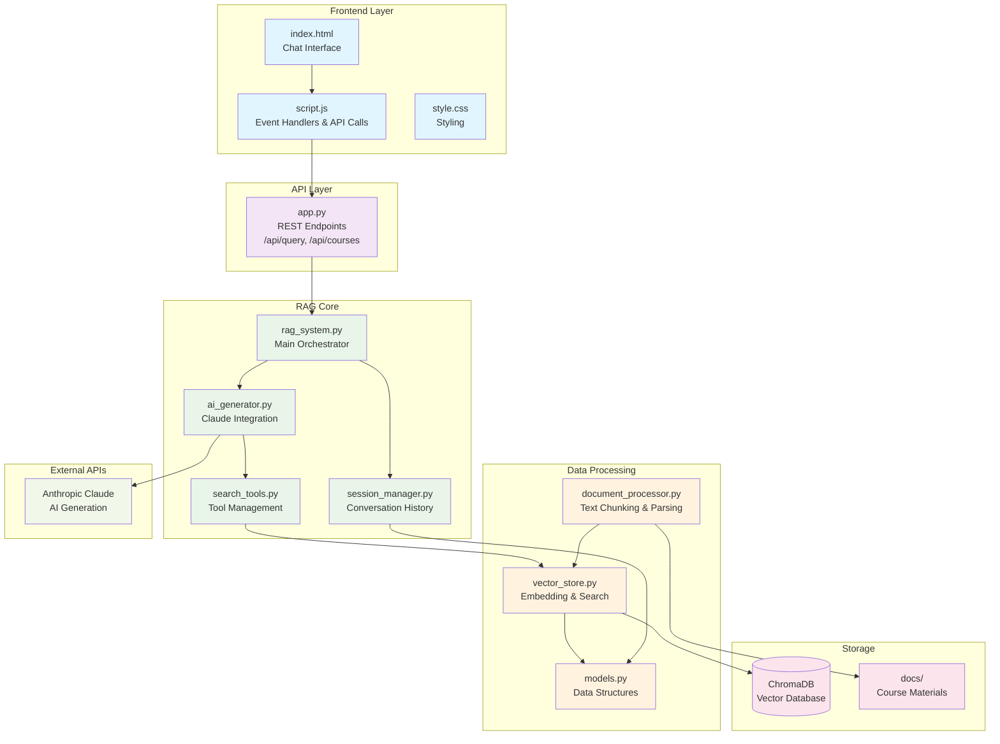

# RAG System Request Flow Diagram

## Component Architecture

## Data Flow Summary

1. **User Input** → Frontend captures and validates
2. **HTTP Request** → JSON payload to FastAPI endpoint  
3. **Session Management** → Create/retrieve conversation context
4. **AI Processing** → Claude analyzes query and decides on tool usage
5. **Vector Search** → Semantic search through course chunks
6. **Response Generation** → Claude synthesizes search results
7. **Response Delivery** → JSON back to frontend with sources
8. **UI Update** → Markdown rendering and source display